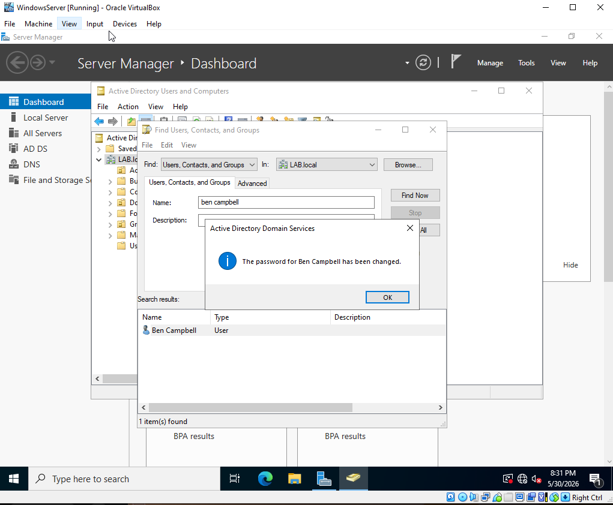
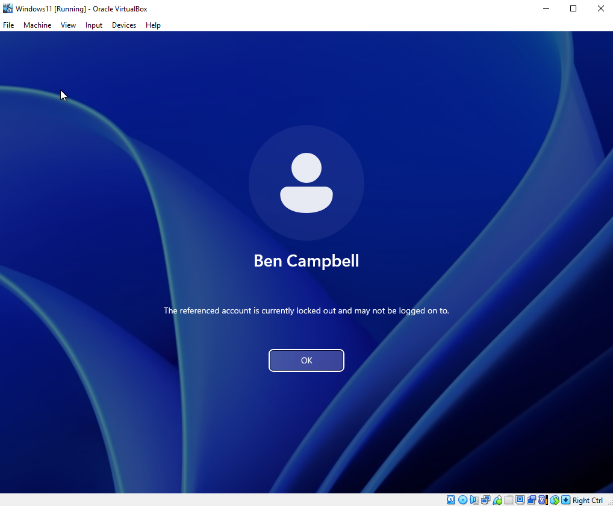
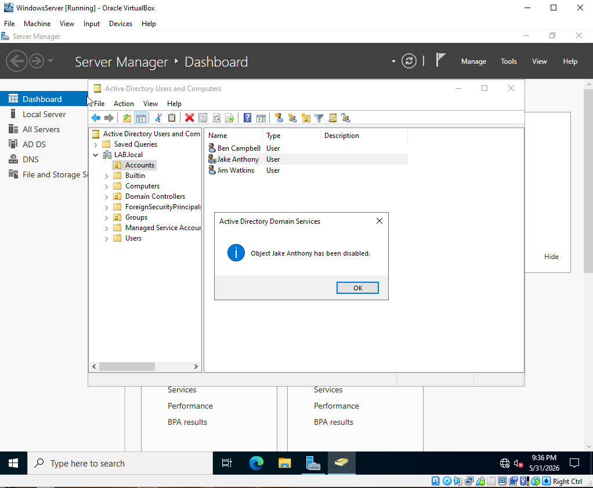

# Active Directory Home Lab — IT Helpdesk Ticketing Scenarios

A continuation of the Active Directory Home Lab series. This section simulates common day-to-day helpdesk tickets that IT support staff handle in a real work environment — all practiced hands-on inside the lab environment.

---

## Environment

| Component | Details |
|---|---|
| Platform | Oracle VirtualBox |
| Domain Controller | Windows Server 2022 |
| Client Machine | Windows 11 |
| Domain Name | LAB.local |

---

## What This Covers

- Password reset for a locked out user
- Unlocking a locked out account
- Disabling and re-enabling user accounts
- Understanding account and password expiration policies

---

## Ticket 1 — Password Reset

User calls in saying they forgot their password and cannot log in. Located the account in Active Directory Users and Computers using the Find tool, performed a password reset with forced change on next logon, and confirmed the user could log in successfully before closing the ticket.

---

## Ticket 2 — Account Lockout

User calls in saying their account is locked after entering the wrong password too many times. The lockout policy in this lab is configured via GPO with the following settings:

- **Lockout Threshold:** 3 invalid attempts
- **Lockout Duration:** 0 — admin must manually unlock
- **Reset Counter:** 3 minutes

Located the account, went to the Account tab, unchecked the lockout, and confirmed with the user before closing the ticket.

---

## Ticket 3 — Account Disable / Enable

Simulated a scenario where HR requests a user account to be disabled — for example when a user goes on extended leave or leaves the company. Also covered the re-enable process, which requires HR confirmation before any action is taken.

> **Important:** Never re-enable an account without HR confirmation even if the user calls in directly. Always verify with HR first.

> **Important:** Never delete a user account even if they permanently leave the company. Always disable it instead — deleted accounts cannot be recovered and can break file ownership, email history, and audit trails.

---

## Ticket 4 — Account Expiration

Covered two types of account expiration:

- **Password Expiration** — enforced via Group Policy, users are prompted to change their password every 60 days
- **Contractor Account Expiration** — accounts with a set end date that automatically expire when the date is reached

> **Important:** Never extend a contractor's account expiration date without manager or HR approval. This is a security policy violation.

---

## Key Takeaways

- Always verify the user's identity before making any account changes
- Never delete accounts — disable them instead
- Always confirm with HR before disabling, enabling, or extending any account
- Stay on the line with the user until they confirm they can log in before closing the ticket
- Admins should never know a user's personal password — always use temporary passwords with forced reset on next logon
- Never extend contractor account expiration dates without proper authorization

---

## Related

- [Part 1 — Setup & Configuration](../Active-Directory-Setup/README.md)
- [Part 2 — User Management & Domain Integration](../Active-Directory-User-Management/README.md)
- [Part 3 — Troubleshooting: Account Recovery](../Active-Directory-Troubleshooting/README.md)
