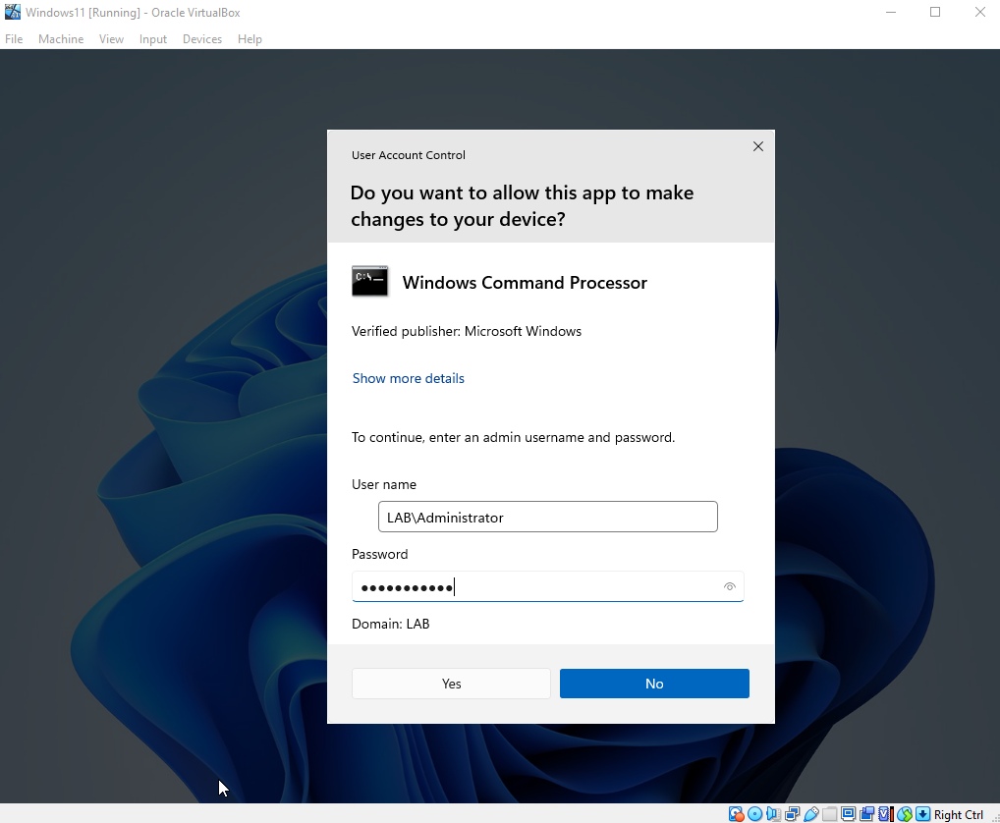
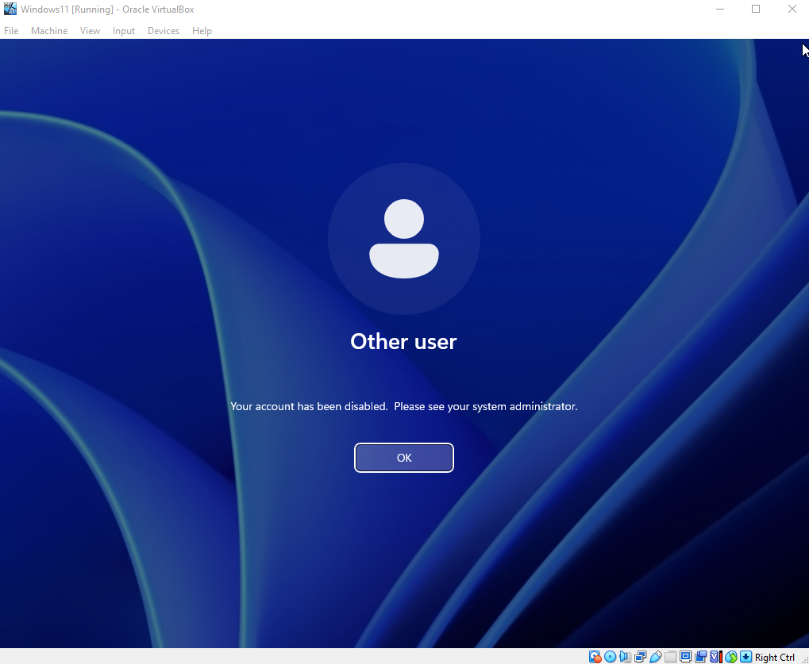
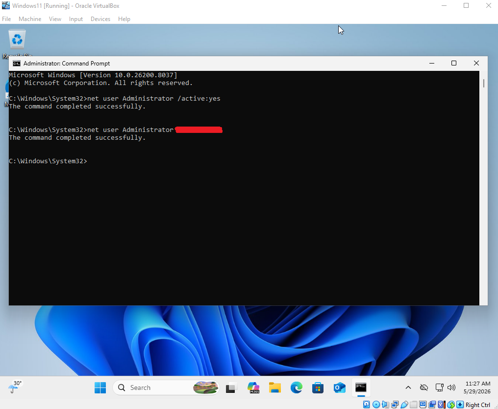
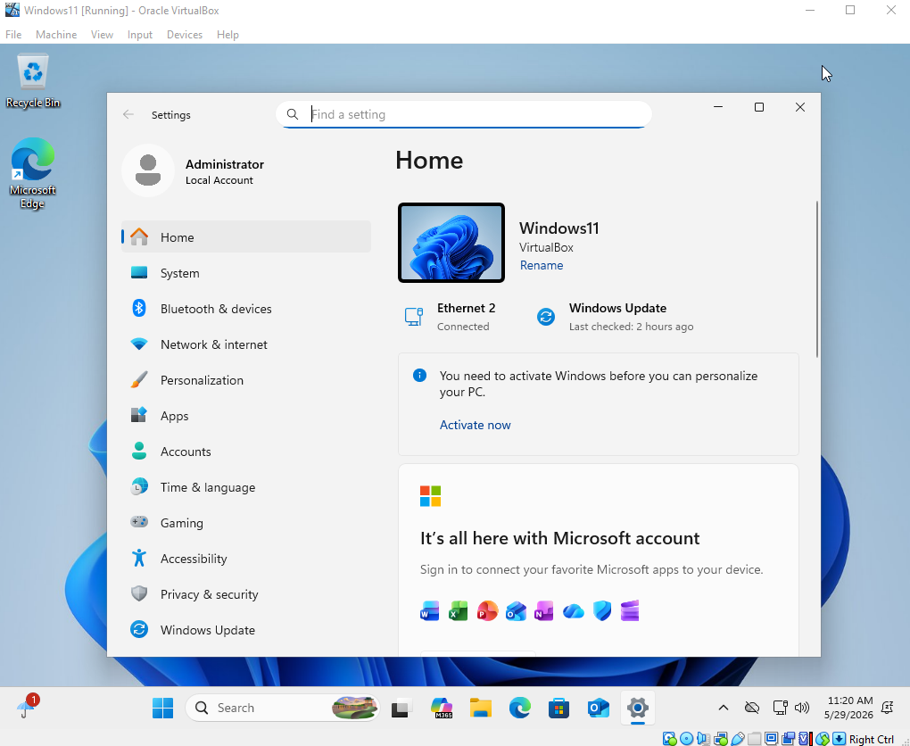

# Troubleshooting — WINDOWS11\Administrator Account Recovery
 
> "I forgot the password. It happens to the best of us."
 
A real troubleshooting scenario that came up during the Active Directory Home Lab. The built-in local Administrator account on the Windows 11 VM was inaccessible due to a forgotten password — and just to make things more interesting, the account was disabled the whole time, too. Great combo.
 
Painful? A little. Good learning experience? Absolutely.
 
---
 
## Environment
 
| Component | Details |
|---|---|
| Platform | Oracle VirtualBox |
| Affected Machine | Windows 11 (Client VM) |
| Domain | LAB.local |
 
---
 
## The Problem
 
Needed to access the `WINDOWS11\Administrator` local account, but the password was completely blanked on. And as if that wasn't enough, the account was disabled on top of it — which is actually expected behavior since the built-in local Administrator account is **disabled by default on every fresh Windows 11 install**. Microsoft does this as a security measure. Would've been nice to know that earlier but here we are.
 
Since the machine was joined to the domain early on, domain accounts like `LAB\Administrator` and `BCampbell` were always used to log in, so the local Administrator account just sat quietly in the background the whole time. It only became a problem when trying to access it directly for the first time. Oops.
 
---
 
## What Was Tried First
 
Checked the Windows Server through Active Directory Users and Computers, thinking maybe the local Windows 11 account could be reset from there. Reasonable guess — but nope. Local machine accounts are not managed through Active Directory at all; only domain accounts are. Nothing related to `WINDOWS11\Administrator` showed up there. Back to square one.
 
---
 
## How It Was Fixed
 
**Step 1 — Log in through a domain user account**
 
Logged into the Windows 11 machine using a domain user account (Ben Campbell) since those credentials were still accessible. Thanks, Ben.
 
**Step 2 — Open CMD using server credentials**
 
Opened Command Prompt and ran it as administrator. Since the local admin was inaccessible, I used `LAB\Administrator` domain credentials to elevate the privileges. Domain admin to the rescue.
 

 
**Step 3 — Reset the password**
 
With elevated CMD open, ran the following command to set a new password:
 
```
net user Administrator YourNewPassword123
```
 
**Step 4 — Hit the disabled account error**
 
Tried logging in as `WINDOWS11\Administrator`, feeling pretty confident — and got slapped with an Account is Disabled error. Of course. The account was never enabled in the first place.
 

 
**Step 5 — Enable the account and reset the password (for real this time)**
 
Back into Ben Campbell's account, opened CMD as admin the same way, and ran:
 
```
net user Administrator /active:yes
net user Administrator YourNewPassword123
```


 
**Step 6 — Finally in**
 
It worked. Sweet sweet success.
 

 
---
 
## Key Takeaways
 
- The built-in local Administrator account is disabled by default on every fresh Windows 11 install — it has to be manually enabled when needed. Would've been useful to know from the start but this is why we do labs
- Local machine accounts and domain accounts are completely separate — local accounts won't show up in Active Directory, no matter how long you stare at it
- As long as you have domain admin credentials, you can elevate CMD privileges on any domain-joined machine to manage local accounts — super useful trick
- Keep track of both local and domain credentials separately — they serve different purposes, and one can save you when the other fails
---
 
## Related
 
- [Part 1 — Setup & Configuration](Setup%20&%20Configuration/README.md)
- [Part 2 — User Management & Domain Integration](User%20Management%20&%20Domain%20Integration/README.md)
