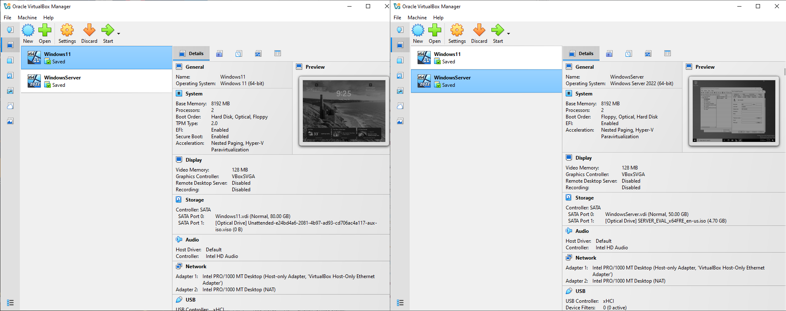

# Active Directory Home Lab — Setup & Configuration
 
A home lab simulating a basic enterprise Active Directory environment using virtual machines. Built to get hands-on experience with Windows Server, domain setup, and identity management — all from a personal machine without needing real hardware.
 
---
 
## Environment
 
| Component | Details |
|---|---|
| Platform | Oracle VirtualBox |
| Domain Controller | Windows Server 2022 |
| Client Machine | Windows 11 |
| Domain Name | LAB.local |
 
---
 
## What I Did
 
- Provisioned two VMs in VirtualBox — a Windows Server 2022 Domain Controller and a Windows 11 client machine
- Renamed the server and configured network adapters (Host-Only + NAT)
- Assigned a static IP to the server so clients can consistently locate the Domain Controller
- Installed the Active Directory Domain Services (AD DS) role
- Promoted the server to a Domain Controller and created a new forest (LAB.local)
---
 
## Screenshots
 
### VM Setup

 
### Static IP Configuration

 
### AD DS Installation

 
### Promoting to Domain Controller

 
---
 
## Network Design Notes
 
Both VMs are configured with a Host-Only adapter and a NAT adapter. The Windows 11 machine gets internet access through NAT since its network settings are handled automatically via DHCP. The Windows Server has a manually assigned static IP with no default gateway, so it has no internet access — even with NAT attached.
 
This is actually realistic. In production environments, Domain Controllers are typically kept off the internet. If internet access were needed, a default gateway would point to the internal router, and DNS Forwarders would be configured on the DC to forward external lookups to a public DNS like Google (8.8.8.8) or Cloudflare (1.1.1.1).
 
---
 
## What I Learned
 
- How Active Directory works as a centralized identity and access management system
- The role of DNS in an AD environment and why the DC points to itself
- How static IP configuration affects network routing and internet access
- The difference between installing AD DS and actually promoting a server to a Domain Controller
---
 
## Full Documentation
 
For the complete step-by-step documentation, see [Active_Directory_Setup.pdf](docs/Active_Directory_Setup.pdf)
