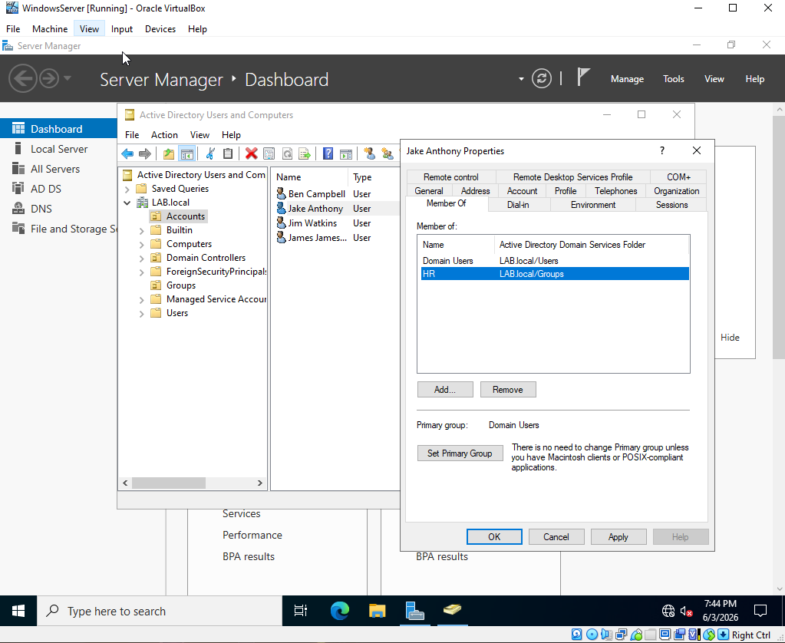
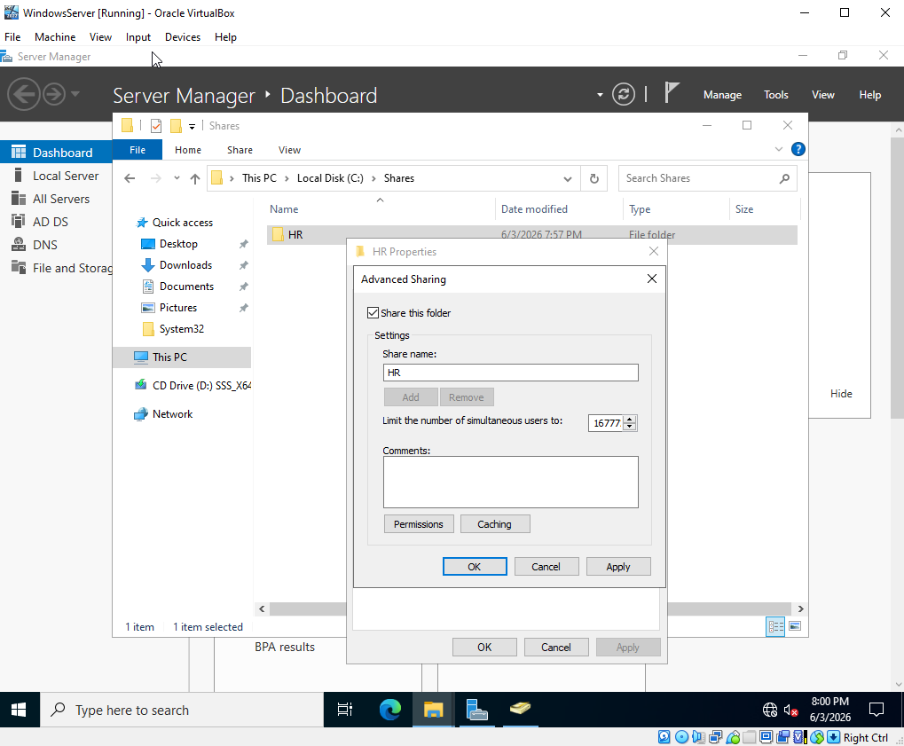
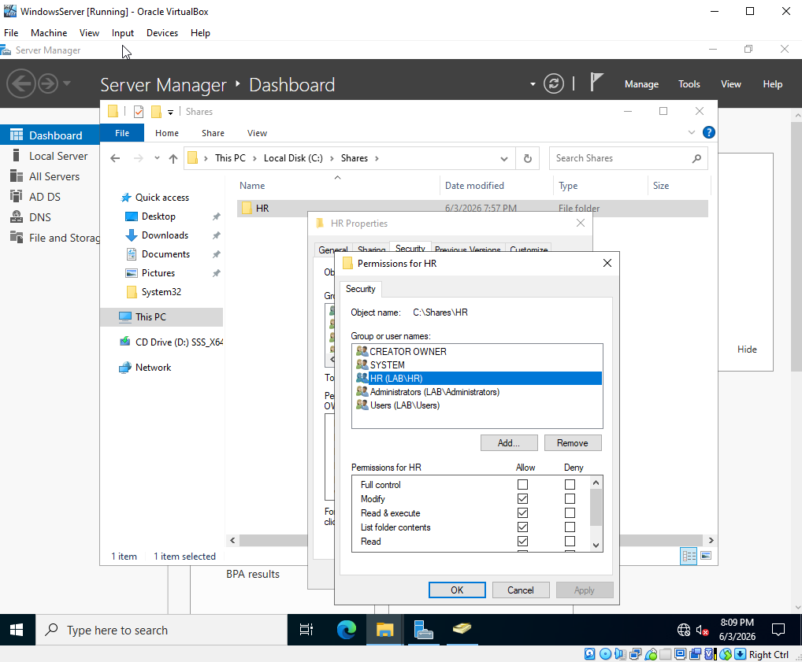
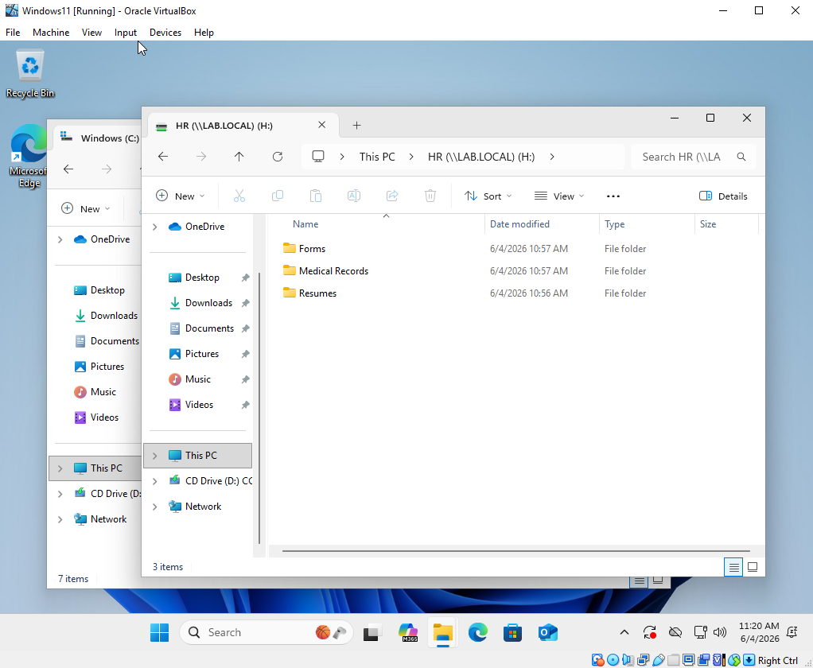
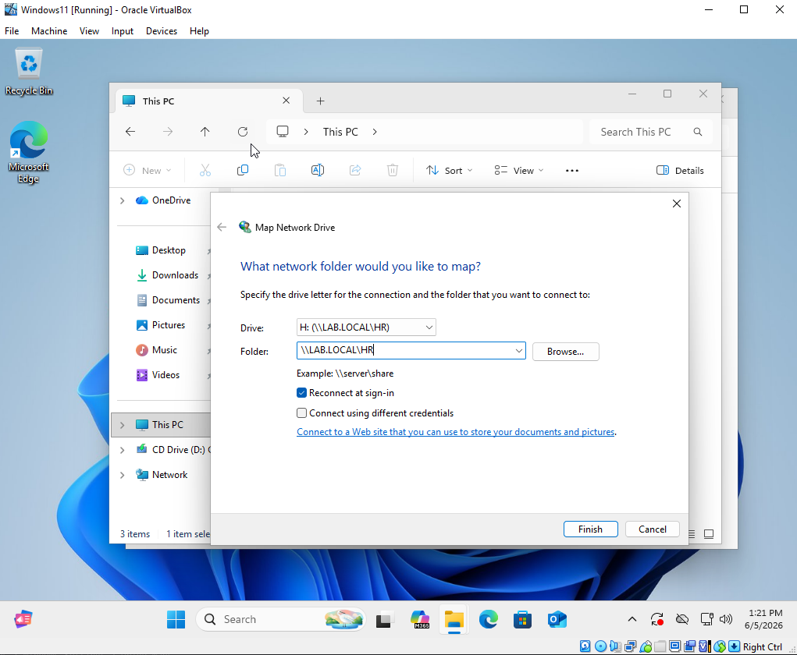
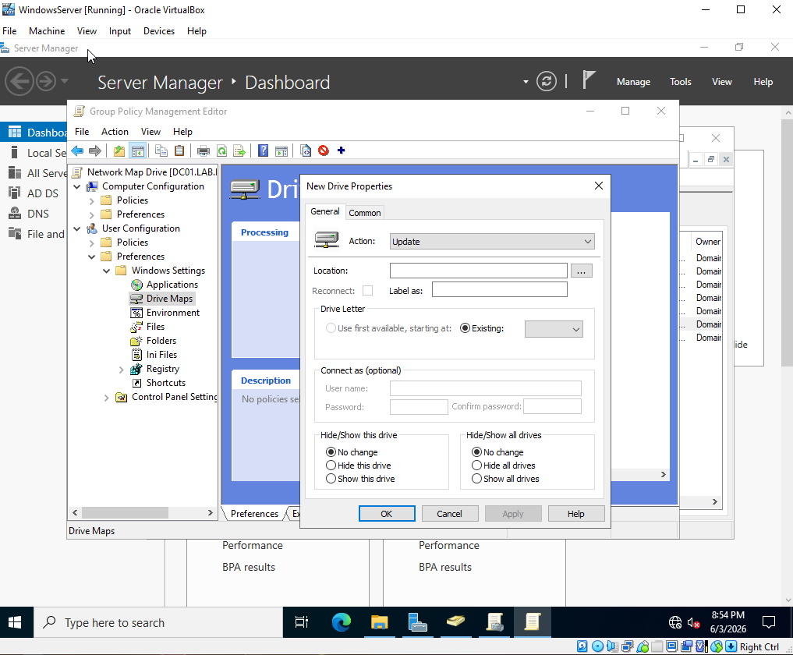
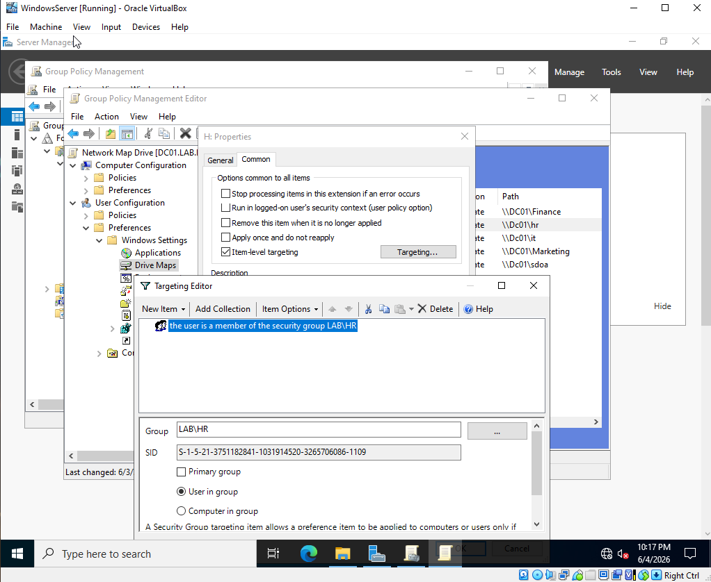

# Active Directory Home Lab — Shared Folder Permissions & Mapped Network Drives

A continuation of the Active Directory Home Lab series. This section covers how to tie user groups to shared folders, control who can access what data on the network, and two ways to give users access to their folders — manually and automatically through Group Policy.

The scenario used throughout: Jake Anthony just started working in HR and needs access to the HR shared folder on the server.

---

## Environment

| Component | Details |
|---|---|
| Platform | Oracle VirtualBox |
| Domain Controller | Windows Server 2022 |
| Client Machine | Windows 11 |
| Domain Name | LAB.local |

---

## What This Covers

- Adding a user to the correct Active Directory group
- Creating a shared folder structure on the server
- Configuring Share Permissions and NTFS Permissions
- Verifying folder access on the client machine
- Manually mapping a network drive
- Automating drive mapping via Group Policy (GPO) with Item-Level Targeting
- Removing user access

---

## Real World Context

**File Servers vs Domain Controllers**
In a production environment shared folders never live on the Domain Controller — they live on a separate dedicated File Server. If the DC crashes and shared data is on the same machine, everything goes down together. In this lab the shared folder is on the DC since it's a single server virtual environment, which is fine for learning purposes.

**Failover Domain Controllers**
Companies always have at least one backup DC. If the only DC goes down, nobody can log in. A common setup is one DC on-site and one in the cloud as a failover.

**Permissions Are Audited**
> **Critical:** Never give a user access to the wrong folder. Permission changes are logged and audited with timestamps — it will be traced back to whoever made the change.

---

## Part 1 — Add User to the Correct Group

Added Jake Anthony to the HR group in Active Directory Users and Computers. Verified by checking the Members tab of the HR group.



> **Best Practice:** Always add users to groups, never assign permissions directly to individual users. When someone joins or leaves, just update the group — never the folder permissions.

---

## Part 2 — Create the Shared Folder Structure

Created a `Shares` root folder on the C: drive of the server. Inside it, created an `HR` folder with subfolders for Resumes, Forms, and Medical Records.



---

## Part 3 — Configure Permissions

Two layers of permissions were configured:

**Share Permissions** — controls access over the network
- Set Everyone to Full Control at the Share level (standard practice — real restriction is at NTFS level)

**NTFS Permissions** — controls access at the file system level
- Added the HR group with Modify permission



> **Note:** Modify lets HR members read, create, edit, and delete files. Do not give Full Control to regular users — Full Control includes the ability to change permissions, which is admin-only.

---

## Part 4 — Verify Access on Client Machine

Logged into the Windows 11 VM as `LAB\JAnthony` and confirmed access to the HR shared folder through File Explorer.



> **Important:** New group memberships don't take effect until the user logs out and back in — one of the most common helpdesk calls after granting folder access.

---

## Part 5 — Manual Network Drive Mapping

Mapped the HR shared folder as the H: drive on the Windows 11 machine through File Explorer > Map network drive.

```
\\LAB.LOCAL\HR → H:
```



> **Best Practice:** Match drive letters to department names — H for HR, F for Finance, I for IT. Easy for users to remember.

---

## Part 6 — Automating Drive Mapping via GPO

Created a **Network Map Drive** GPO to automatically map the H: drive for HR group members on every login — no manual mapping needed.

**Path in Group Policy Editor:**
```
User Configuration > Preferences > Windows Settings > Drive Maps
```

**Item-Level Targeting** was configured so the drive only appears for users in the HR security group — without it, the drive would show up for every user on the domain regardless of their group.





> **Note:** Use log out and log back in when testing GPO drive maps — `gpupdate /force` alone sometimes doesn't refresh drive map preferences reliably.

---

## Part 7 — Removing User Access

Removed Jake Anthony from the HR group in Active Directory. Access was revoked immediately — no need to touch the folder or GPO at all.

---

## Key Takeaways

- Shared folders belong on a File Server, not the Domain Controller
- There are two permission layers — Share Permissions open the network door, NTFS Permissions control what users can do inside
- Always assign permissions to Groups, never individual users
- Regular users get Modify — Full Control is for administrators only
- New group memberships and GPO drive maps require a log out and back in to take effect
- Item-Level Targeting is essential for GPO drive maps — without it every user sees every drive
- Permissions are audited — every change is logged with a timestamp
- GPO automation is the real world standard — no IT department maps drives manually for hundreds of users

---

## Related

- [Part 1 — Setup & Configuration](../Setup%20&%20Configuration/README.md)
- [Part 2 — User Management & Domain Integration](../User%20Management%20&%20Domain%20Integration/README.md)
- [Part 3 — Forgot Password](../Forgot%20Password/README.md)
- [Part 4 — Basic IT Ticketing](../Basic%20IT%20Ticketing/README.md)
- [Part 5 — Group Policy Objects](../Adding%20GPO/README.md)
