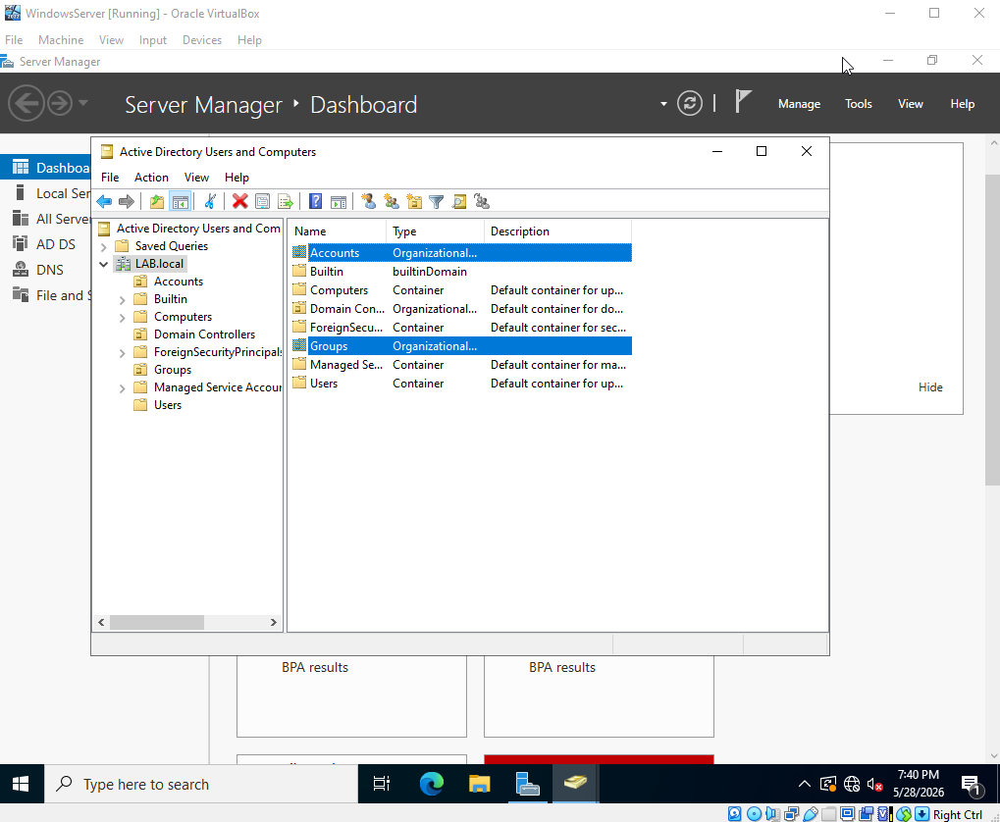
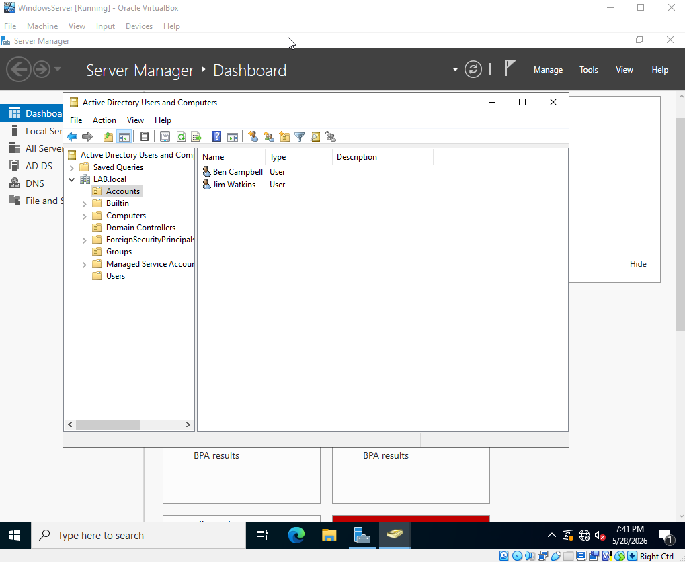
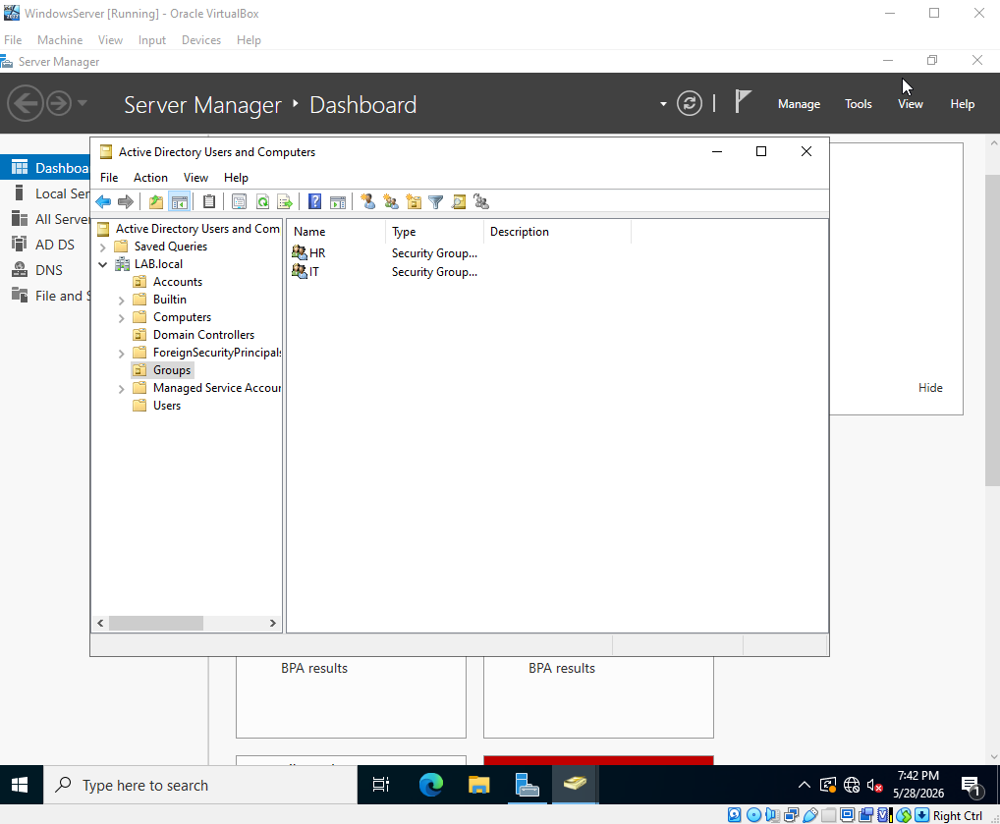
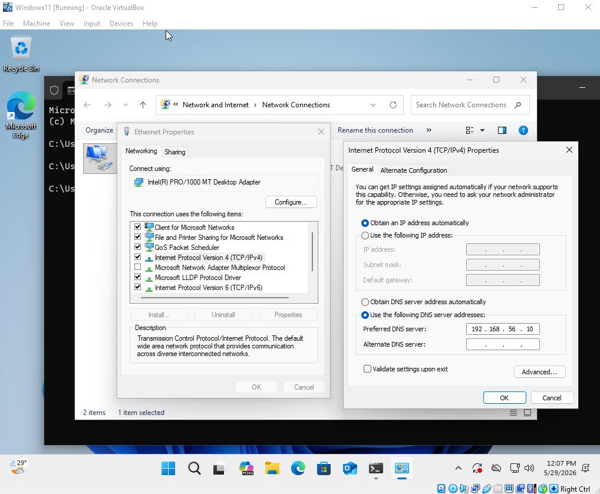
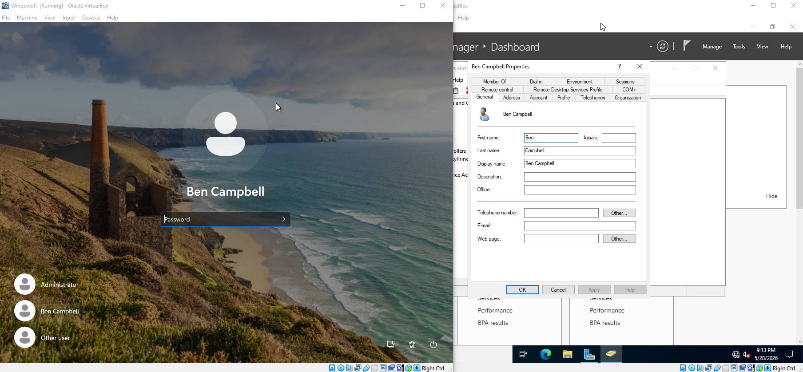

# Active Directory Home Lab — User Management & Domain Integration
 
A continuation of the Active Directory Home Lab setup. With the Domain Controller already configured, this part covers the day-to-day tasks that IT helpdesk and sysadmin staff handle in a real work environment — creating users, organizing them, and connecting a client machine to the domain.
 
---
 
## Environment
 
| Component | Details |
|---|---|
| Platform | Oracle VirtualBox |
| Domain Controller | Windows Server 2022 |
| Client Machine | Windows 11 |
| Domain Name | LAB.local |
 
---
 
## What I Did
 
- Created Organizational Units (OUs) to organize users and groups inside Active Directory
- Added a user account and set up a forced password reset on first login
- Created IT and HR security groups
- Pointed the Windows 11 client DNS to the Domain Controller
- Joined the Windows 11 machine to the LAB.local domain
- Logged in as a domain user from the client machine
---
 
## Screenshots
 
### Creating Organizational Units

 
### Adding a User Account

 
### Adding Groups

 
### Pointing Client DNS to the Server

 
### Logging in as a Domain User

 
---
 
## Key Takeaways
 
- OUs keep the AD environment organized and make it easier to apply Group Policies to specific departments without affecting everyone else
- Admins should never know a user's password — temporary passwords with a forced reset on first login is the standard security practice
- The client's DNS must point to the Domain Controller before it can join the domain — without it, the machine can't locate the domain at all
- Commands like `ncpa.cpl` and `sysdm.cpl` are useful shortcuts when certain settings don't show up through the normal Windows UI, especially inside VMs
- Once a machine is on the domain, any valid AD user account can log into it — not just a local account
---
 
## Full Documentation
 
For the complete step-by-step documentation, see [Active_Directory_to_DC.pdf](docs/Active_Directory_to_DC.pdf)
 
---
 
## Related
 
- [Part 1 — Setup & Configuration](../Active-Directory-Setup/README.md)
