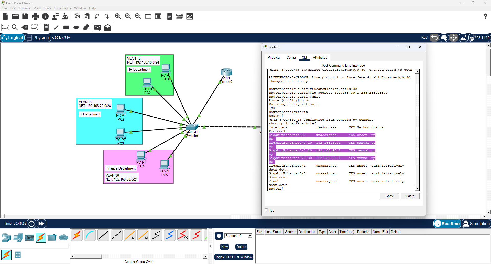
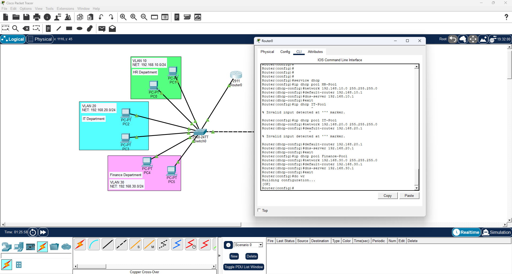
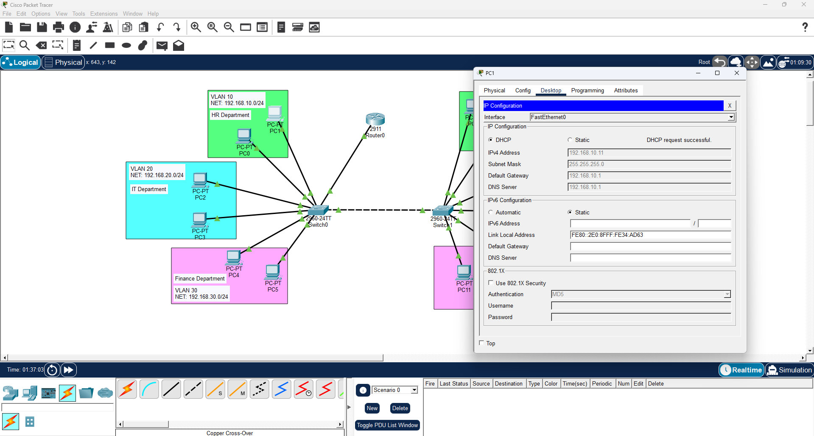

# Cisco Packet Tracer — Level 4: DHCP (Dynamic Host Configuration Protocol)

Building on Levels 2 and 3, this section adds DHCP to the existing VLAN and inter-VLAN routing topology. Instead of manually assigning IP addresses to every PC, the router now handles that automatically — handing out the correct IP, subnet mask, default gateway, and DNS server to any device that connects to the network.

---

## Environment

| Component | Details |
|---|---|
| Tool | Cisco Packet Tracer |
| Router | Cisco 2911 |
| Switches | 2x Cisco 2960-24TT |
| End Devices | 12 PCs |
| VLANs | 3 (HR, IT, Finance) |
| DHCP Server | Router (Layer 3) |

---

## What This Covers

- Why DHCP is a Layer 3 function and why it's configured on the router
- What a DHCP pool is and why each VLAN needs its own
- How to enable DHCP on the router and create pools per VLAN
- How to exclude reserved IP addresses from dynamic assignment
- How to set PCs to DHCP mode and verify automatic IP assignment
- Troubleshooting DHCP failures

---

## Why Switches and Routers Work Together

A **switch acts like a toll gate** — it allows or rejects traffic based on VLAN membership. Without it, every packet from every device floods the entire network simultaneously, causing congestion, security issues, and in extreme cases a broadcast storm where the network chokes itself completely.

A **router acts as the decision maker** — it knows all the subnets, decides where traffic goes, and in this level also manages automatic IP assignment through DHCP.

Together they create a structured network — the switch enforces the boundaries between departments, while the router manages controlled communication across those boundaries and assigns the right IP to every device that joins.

---

## What is DHCP?

DHCP (Dynamic Host Configuration Protocol) is a **Layer 3 function** — it deals with IP addressing which is a network layer concern. When a PC is set to DHCP mode and connects to the network it sends a broadcast asking for an IP address. The router receives this, checks which VLAN the PC is on, looks up the matching DHCP pool, and automatically assigns:

- **IP Address** — unique address for that device
- **Subnet Mask** — defines which network it belongs to
- **Default Gateway** — so it knows where to send traffic outside its VLAN
- **DNS Server** — for resolving domain names

> **Note:** In a real enterprise environment the DNS server would be a dedicated server or public DNS like 8.8.8.8. In this lab the router subinterface IP is used since the lab network is isolated with no real internet connection.

---

## Network Topology


Same topology as Level 3 — one router, two switches, 12 PCs across 3 departments. The difference is PCs are no longer manually configured with IPs.

---

## Step 1 — VLANs, Ports, and Trunk Links

Same configuration as Level 2 — create VLANs, assign ports, and configure trunk links. The only difference: **do not assign IP addresses to the PCs yet.**

```
vlan 10 → name HR
vlan 20 → name IT
vlan 30 → name Finance

Access ports per department
Trunk on Fa0/24 (switch to switch)
Trunk on Gig0/1 (switch to router) ← don't forget this one!
```

> **Important:** Verify both trunk ports with `show interfaces trunk` before moving on.

---

## Step 2 — Router Subinterfaces

Same as Level 3 — configure subinterfaces with encapsulation dot1q. These IPs also serve as the default gateways assigned by DHCP.

```
int gig0/0
no shutdown
exit

int gig0/0.10
encapsulation dot1q 10
ip address 192.168.10.1 255.255.255.0
exit

int gig0/0.20
encapsulation dot1q 20
ip address 192.168.20.1 255.255.255.0
exit

int gig0/0.30
encapsulation dot1q 30
ip address 192.168.30.1 255.255.255.0
exit
do wr
```



---

## Step 3 — Configure DHCP Pools

This is the main new configuration in this level. One DHCP pool is created per VLAN — each pool defines the network range the router assigns IPs from for that department.

First enable the DHCP service:
```
service dhcp
```

Then create the pools:
```
ip dhcp pool HR-Pool
network 192.168.10.0 255.255.255.0
default-router 192.168.10.1
dns-server 192.168.10.1
exit

ip dhcp pool IT-Pool
network 192.168.20.0 255.255.255.0
default-router 192.168.20.1
dns-server 192.168.20.1
exit

ip dhcp pool Finance-Pool
network 192.168.30.0 255.255.255.0
default-router 192.168.30.1
dns-server 192.168.30.1
exit

do wr
```



Verify pools are configured:
```
show ip dhcp pool
```

---

## Step 4 — Exclude Reserved IP Addresses

Before DHCP starts assigning IPs, reserved addresses need to be excluded — otherwise DHCP might assign the gateway IP to a regular PC causing a conflict.

```
ip dhcp excluded-address 192.168.10.1 192.168.10.10
ip dhcp excluded-address 192.168.20.1 192.168.20.10
ip dhcp excluded-address 192.168.30.1 192.168.30.10
do wr
```

> **Best Practice:** Excluding .1 to .10 of each subnet is standard practice. The .1 address is the gateway, and .2 through .10 are kept for static assignment to infrastructure devices like servers or printers. DHCP assigns addresses starting from .11 onwards to regular client devices.

---

## Step 5 — Set PCs to DHCP and Verify

Switch each PC from Static to DHCP mode:

1. Click on a PC → **Desktop → IP Configuration**
2. Select **DHCP**
3. The PC should automatically receive an IP, subnet mask, default gateway, and DNS server
4. Verify the IP is in the correct range — HR should get 192.168.10.11+, IT 192.168.20.11+, Finance 192.168.30.11+


Check which IPs have been assigned from the router:
```
show ip dhcp binding
```

---

## Troubleshooting — DHCP Failed

After switching a PC to DHCP mode it showed a **"DHCP Failed"** error instead of receiving an IP automatically.

**Root Cause:** The switch port connected to the router was not configured as a trunk. DHCP requests are broadcasts that travel from the PC through the switch to the router. If the router port is in access mode, the VLAN-tagged DHCP broadcast never reaches the router — so it never responds.

**Fix:**
```
int gig0/1
switchport mode trunk
exit
do wr
```

After trunking the router port, DHCP immediately worked on all PCs.



> **Discovery:** This is now the second time the missing router trunk caused a failure — first in Level 3 with inter-VLAN routing, and again here with DHCP. The rule stays the same: any port carrying multiple VLANs must be a trunk, including the router port. Always verify with `show interfaces trunk` before testing.

---

## Key Takeaways

- DHCP is a Layer 3 function — configured on the router, not the switch
- Each VLAN needs its own DHCP pool matching its subnet
- Always run `service dhcp` before creating pools
- Exclude reserved addresses before testing — gateway IPs must never be assigned to regular PCs
- The router trunk port must still be configured — DHCP broadcasts won't reach the router without it
- `show ip dhcp pool` — verifies pool configuration
- `show ip dhcp binding` — shows which IPs have been assigned and to which devices

---

## Related

- [Level 1 — Basic Network Setup & Connectivity](../Setup%20%26%20Network%20Connectivity/README.md)
- [Level 2 — VLANs and Trunking](../VLAN%20%26%20Trunking/README.md)
- [Level 3 — Inter-VLAN Routing](../Inter-VLAN%20Routing/README.md)
- [Packet Tracer Home Lab — Main](../README.md)
