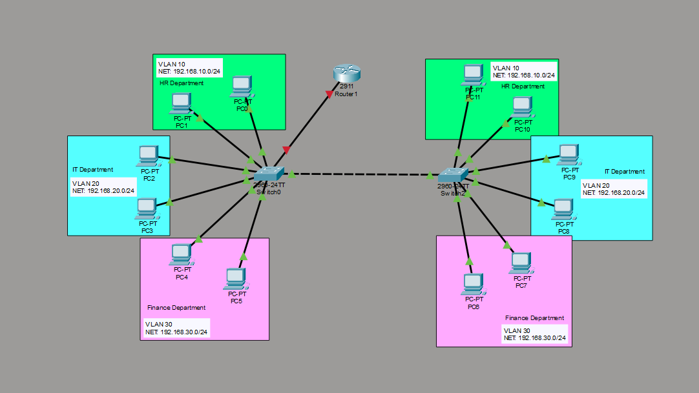
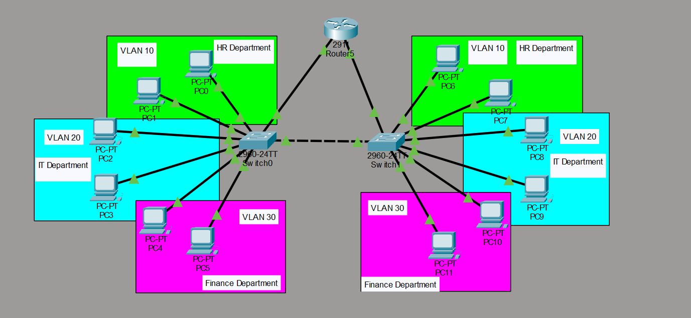
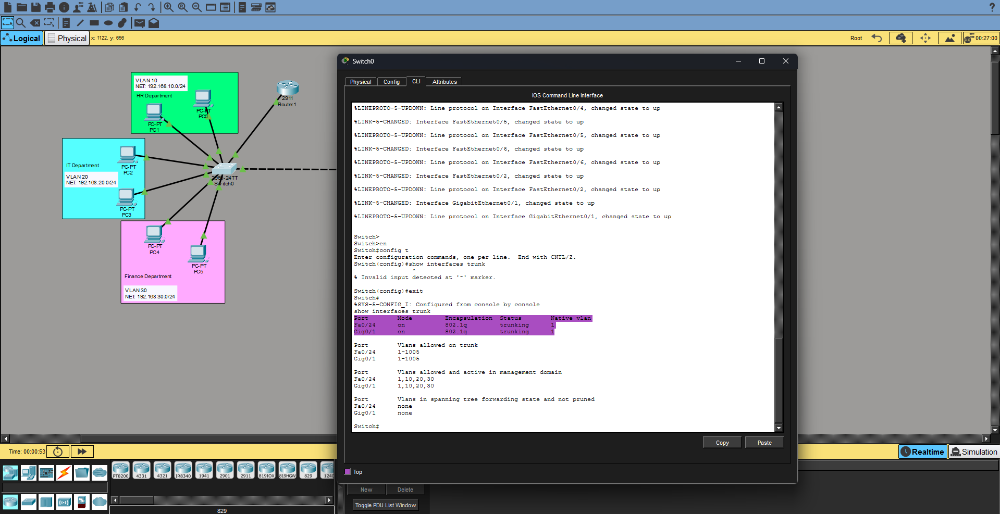
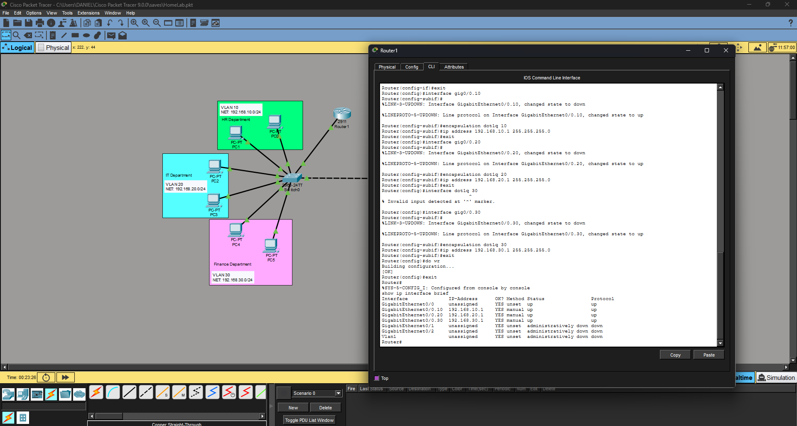
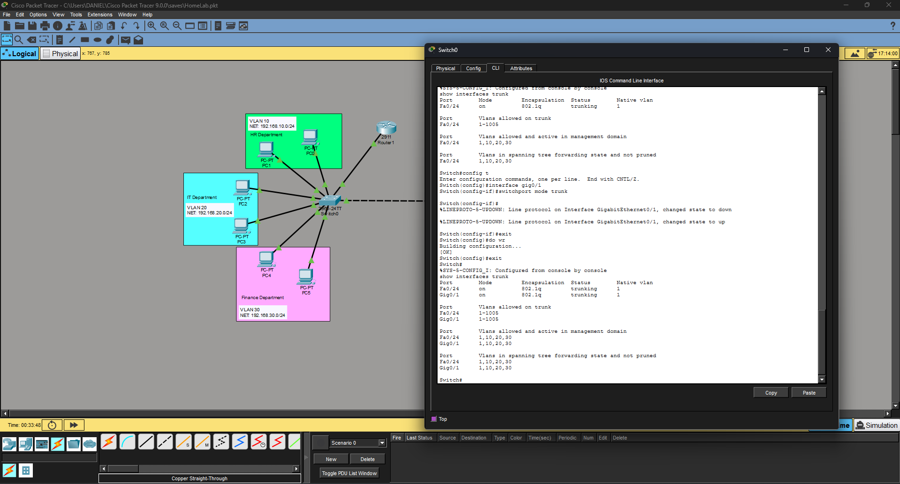
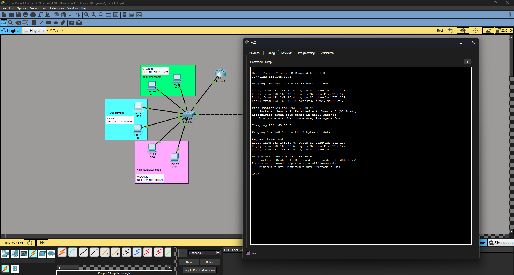

# Cisco Packet Tracer — Level 3: Inter-VLAN Routing (Router on a Stick)

Building on the VLAN and trunking topology from Level 2, this section implements Inter-VLAN Routing — allowing devices on different VLANs to communicate with each other through a router.

This was the most educational section of the lab series so far. Not because the configuration is complex — but because almost nothing worked on the first try. Every mistake led to a real discovery, and those discoveries are documented here just as much as the working configuration.

---

## Environment

| Component | Details |
|---|---|
| Tool | Cisco Packet Tracer |
| Router | Cisco 2911 |
| Switches | 2x Cisco 2960-24TT |
| End Devices | 12 PCs |
| VLANs | 3 (HR, IT, Finance) |
| Method | Router on a Stick |

---

## What This Covers

- Understanding why Router on a Stick is used over connecting a router to multiple switches
- What subinterfaces are and why they are needed
- What encapsulation dot1q does and why it matters
- Configuring a router with subinterfaces for multiple VLANs
- Why the switch port connected to the router also needs to be a trunk
- Assigning correct default gateways per VLAN
- Real troubleshooting steps taken when inter-VLAN routing did not work

---
## Video Walkthrough
📹 A complete walkthrough of this lab is available on my LinkedIn, demonstrating the implementation from topology creation to Inter-VLAN Routing verification.

🔗 LinkedIn Post: [https://www.linkedin.com/posts/danieltenoriolacosta_cisco-ccna-networking-ugcPost-7485692340255358976--Xcd/?utm_source=share&utm_medium=member_desktop&rcm=ACoAAGGRr0wBFhTqBKJKMzOABNZ4ZGuabg4yRUA]
---

## Network Topology



One Cisco 2911 router connected to Switch0 via a single cable. The existing trunk link between Switch0 and Switch1 from Level 2 remains in place. The router uses subinterfaces to handle all 3 VLANs through one physical connection.

---

## Key Concept — Router on a Stick

Instead of connecting the router to every switch, Router on a Stick uses **one physical cable** and **subinterfaces** — virtual ports created inside a single physical port — to handle multiple VLANs simultaneously.

```
Gig0/0          ← physical port (no IP here)
Gig0/0.10       ← virtual subinterface for VLAN 10
Gig0/0.20       ← virtual subinterface for VLAN 20
Gig0/0.30       ← virtual subinterface for VLAN 30
```

Each subinterface gets its own IP address which acts as the default gateway for that VLAN.

**Encapsulation dot1q** tells each subinterface which VLAN tag to look for on incoming traffic. Without it the router has no idea which VLAN a packet belongs to.

> **Note:** dot1q stands for IEEE 802.1Q — the industry standard protocol for VLAN tagging. It is what Cisco switches use by default when trunking.

---

## ⚠️ Troubleshooting — What Went Wrong First

> This section documents the real mistakes made before getting inter-VLAN routing to work. Every issue below is something that actually happened, was identified through CLI commands, and fixed. The correct configuration comes after this section.

---

### Issue 1 — Router Connected to Both Switches

**What happened:** The first attempt connected the router to both switches with separate IPs as gateways:
- Switch0 side → `192.168.0.1`
- Switch1 side → `192.168.1.1`



All pings timed out immediately.

**Why it failed:** The gateway IPs (192.168.0.x) were on completely different subnets from the VLAN subnets (192.168.10.x, 20.x, 30.x). The PCs couldn't reach a gateway that wasn't on their own network.

**Fix:** Switched to Router on a Stick — one connection with subinterfaces matching each VLAN subnet exactly.

---

### Issue 2 — Subinterfaces Configured on the Wrong Router Port

**What happened:** Subinterfaces were configured on `Gig0/0` but the physical cable connecting the router to Switch0 was actually plugged into `Gig0/1` on the router. Inter-VLAN routing still didn't work.

**How it was identified:** Running `show ip interface brief` showed Gig0/1 as down and Gig0/0 had no physical connection — the subinterfaces were on the wrong port the whole time.

**Fix:** Removed the subinterfaces from Gig0/0 and recreated them on the correct port after verifying the physical cable location in the topology.

> **Lesson:** Always verify which physical port the cable is actually connected to before configuring subinterfaces. One wrong port number and nothing works.

---

### Issue 3 — Switch Port Connected to Router Not Set to Trunk

**What happened:** Even after fixing the port issue, pinging the default gateway from any PC still timed out. The ARP table on the PCs showed only same-VLAN devices — the gateway IP never appeared.

**How it was identified:** Running `show interfaces trunk` on Switch0 only showed `Fa0/24` — the switch to switch trunk. The router port `Gig0/1` was completely missing from the list.

Running `show interfaces gig0/1 status` confirmed it:
```
Gig0/1    connected    1    a-full    a-100    10/100/1000BaseTX
```

The port was still in **access mode on VLAN 1** — none of the VLAN-tagged traffic was reaching the router at all. The router configuration was actually correct the whole time.

**Fix:**
```
int gig0/1
switchport mode trunk
exit
do wr
```

After this both trunk ports showed up in `show interfaces trunk` and inter-VLAN routing worked immediately.



> **Discovery:** The switch port connected to the router must also be a trunk — not just the switch to switch connection. The rule is simple: one VLAN through a cable = access port, multiple VLANs through a cable = trunk port. This applies to the router connection too since the router subinterfaces carry all 3 VLANs through one physical cable.

---

## Configuration — The Correct Way

With the lessons from troubleshooting in mind, here is the complete working configuration from start to finish.

---

### Step 1 — Add the Router

Added a Cisco 2911 router to the topology and connected it to Switch0 using a single cable — **Gig0/0** on the router side, **Gig0/1** on the switch side.


---

### Step 2 — Configure Subinterfaces on the Router

```
en
config t

int gig0/0
no shutdown
exit

int gig0/0.10
encapsulation dot1q 10
ip address 192.168.10.1 255.255.255.0
exit

int gig0/0.20
encapsulation dot1q 20
ip address 192.168.20.1 255.255.255.0
exit

int gig0/0.30
encapsulation dot1q 30
ip address 192.168.30.1 255.255.255.0
exit

do wr
```

Verify with:
```
show ip interface brief
```

All three subinterfaces should show as **up/up** with their correct IPs.



---

### Step 3 — Trunk the Switch Port Connected to the Router

```
int gig0/1
switchport mode trunk
exit
do wr
```

Verify both trunk ports are active:
```
show interfaces trunk
```

You should see **two** trunk ports:
- `Fa0/24` — switch to switch trunk ✅
- `Gig0/1` — switch to router trunk ✅



---

### Step 4 — Assign Default Gateways on All PCs

| VLAN | Department | Default Gateway |
|---|---|---|
| VLAN 10 | HR | 192.168.10.1 |
| VLAN 20 | IT | 192.168.20.1 |
| VLAN 30 | Finance | 192.168.30.1 |

> **Important:** Default gateways must be set on ALL 12 PCs across both switches — not just one side.

---

### Step 5 — Test Inter-VLAN Connectivity

**Same VLAN ping:**
```
ping 192.168.20.4
```
Result: ✅ Immediate reply

**Cross-VLAN ping:**
```
ping 192.168.30.5
```
Result: ⚠️ First 1-2 packets may time out then replies come in — this is normal. The router needs to perform an ARP request to find the destination MAC address first. Once resolved all future pings reply immediately.



---

## Key Takeaways

- Router on a Stick uses subinterfaces to handle multiple VLANs through one physical cable
- Encapsulation dot1q tells each subinterface which VLAN tag to listen for
- **Any port carrying multiple VLANs must be a trunk** — including the port connected to the router
- Always verify which physical port the cable is connected to before configuring subinterfaces
- Default gateways must be set on every single PC across all switches
- `show interfaces trunk` — if a port is missing from this list it is still in access mode
- `show ip route` — confirms the router knows about all three VLAN subnets
- First cross-VLAN ping timing out is normal — ARP needs to resolve first

---

## Related

- [Level 1 — Basic Network Setup & Connectivity](../Setup%20%26%20Network%20Connectivity/README.md)
- [Level 2 — VLANs and Trunking](../VLAN%20%26%20Trunking/README.md)
- [Packet Tracer Home Lab — Main](../README.md)
