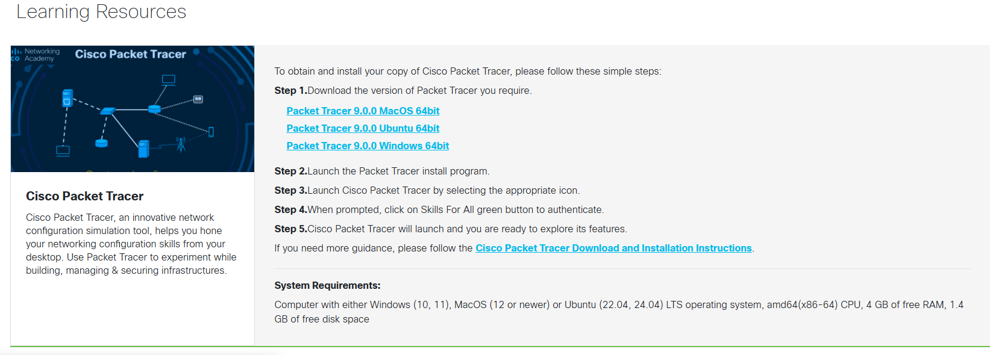
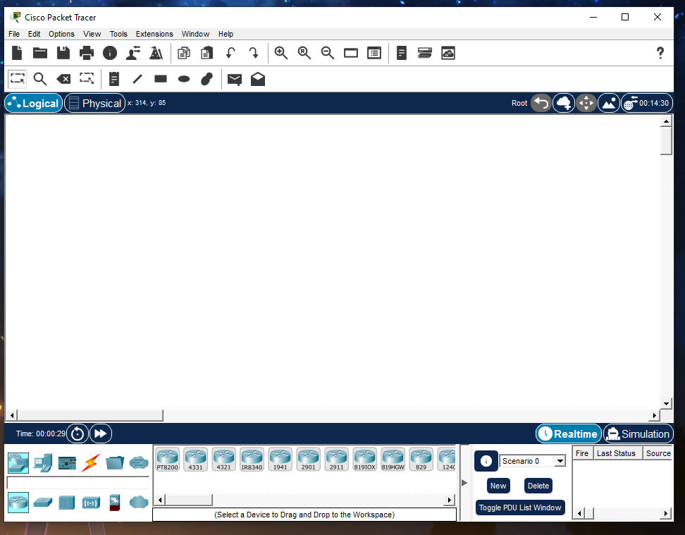
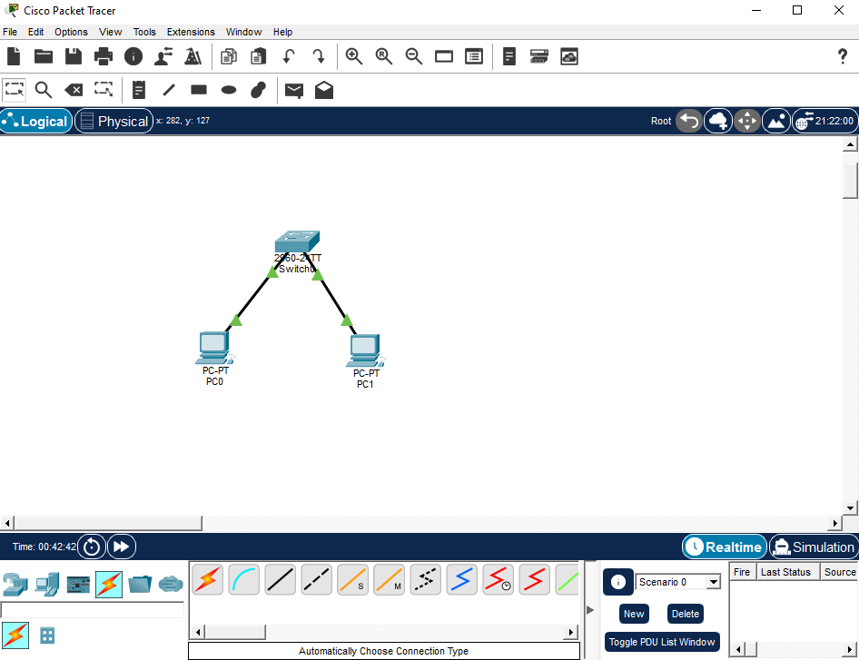
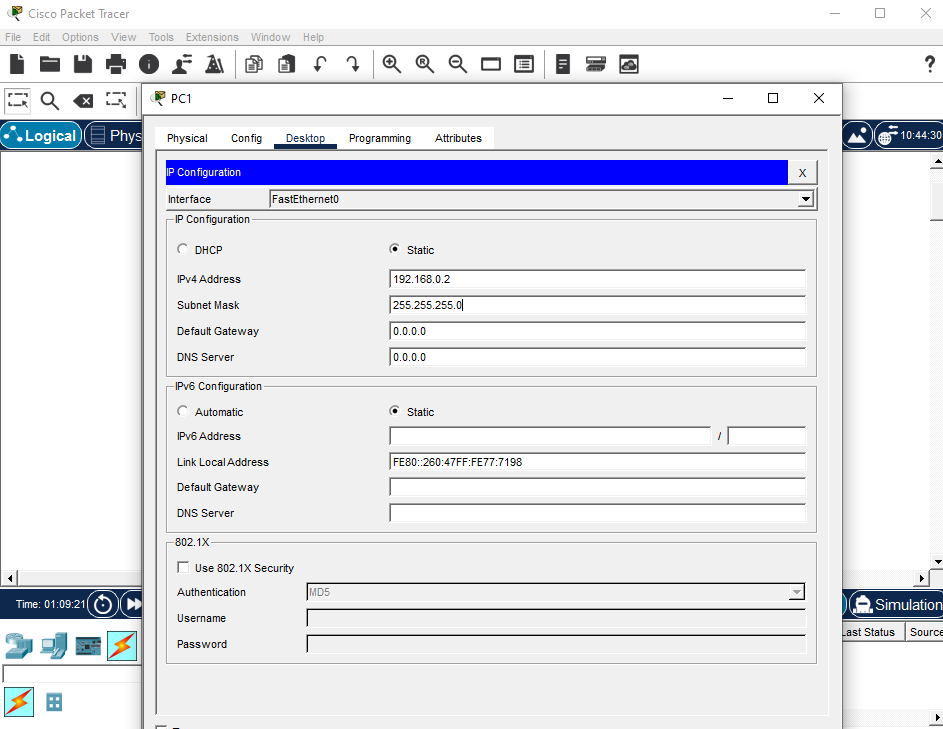
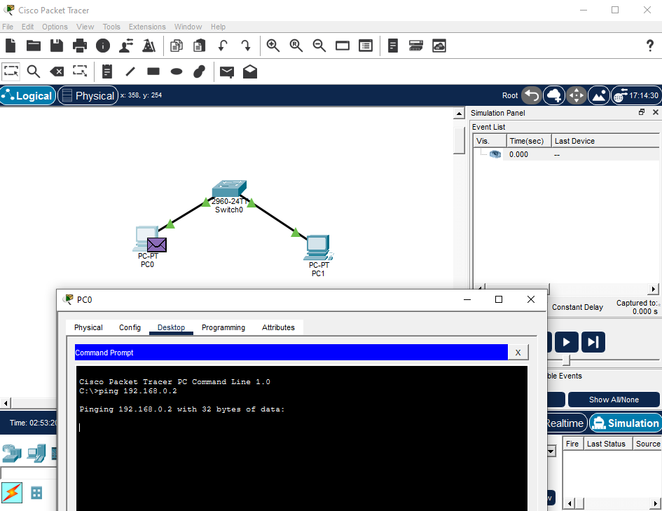
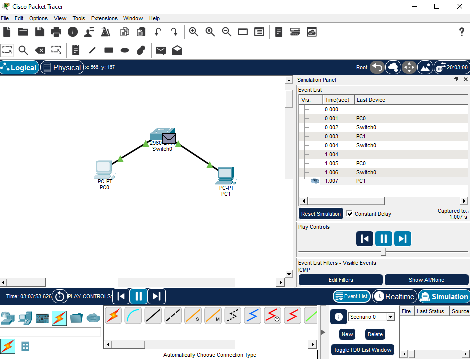

# Cisco Packet Tracer — Level 1: Basic Network Setup & Connectivity

The starting point of the Cisco Packet Tracer home lab series. This section covers getting Packet Tracer installed, understanding the interface, and building a basic two-PC network connected through a switch — including static IP configuration and connectivity testing.

---

## Environment

| Component | Details |
|---|---|
| Tool | Cisco Packet Tracer |
| Topology | 1 Switch + 2 PCs |
| IP Range | 192.168.0.0/24 |

---

## What This Covers

- Downloading and setting up Cisco Packet Tracer
- Understanding the workspace and interface
- Building a basic network topology with a switch and two PCs
- Assigning static IP addresses to end devices
- Testing connectivity between devices using ping
- Using Simulation Mode to visualize ICMP network traffic

---

## Part 1 — Downloading Cisco Packet Tracer

Packet Tracer is completely free and available through Cisco's NetAcad platform at **netacad.com**. An active NetAcad account is required to download and use the application.



---

## Part 2 — Understanding the Interface

Before building anything it helps to know where everything is in the workspace.

**Key areas of the interface:**
- **Device Menu (bottom panel)** — where you select and drag devices onto the workspace. Categories include Network Devices, End Devices, and Connections
- **Workspace** — the main area where you build your network topology
- **Logical vs Physical View** — Logical View is where most work happens. Physical View shows a realistic simulation of what the network would look like in real life
- **Toolbar (top left)** — tools for selecting, deleting, inspecting, and labeling devices



---

## Part 3 — Building the Basic Topology

Added two PCs and one switch to the workspace and connected them using Copper Straight-Through cables.

- **PC0** connected to Switch FastEthernet0/1
- **PC1** connected to Switch FastEthernet0/2



> **Tip:** If unsure which cable to use, click the lightning bolt icon to let Packet Tracer automatically choose the correct cable type.

---

## Part 4 — Configuring Static IP Addresses

Each PC was assigned a static IP address manually through Desktop > IP Configuration.

| Device | IP Address | Subnet Mask |
|---|---|---|
| PC0 | 192.168.0.1 | 255.255.255.0 |
| PC1 | 192.168.0.2 | 255.255.255.0 |



> **Note:** Both PCs must be on the same network to communicate directly without a router. 192.168.0.1 and 192.168.0.2 are both within the 192.168.0.0/24 network range.

---

## Part 5 — Testing Connectivity with Ping

Opened Command Prompt on PC0 and ran a ping to PC1 to verify connectivity.

```
ping 192.168.0.2
```

A successful ping returns **Reply from 192.168.0.2** confirming the two devices can communicate through the switch.



> **Note:** Ping uses ICMP (Internet Control Message Protocol) to send a small test packet from one device to another. It is the most basic and commonly used network troubleshooting tool in real IT and networking environments.

---

## Part 6 — Simulation Mode

Switched to Simulation Mode to visually see ICMP packets moving across the network in real time. Filtered events to show only ICMP traffic, then ran the ping again to watch the packets travel from PC0 through the switch to PC1.

Clicking on any packet envelope shows its details including the OSI model layers it passed through and the source and destination IP addresses.



---

## Key Takeaways

- Packet Tracer is free and one of the best tools for learning networking — especially for CCNA preparation
- Devices on the same network can communicate directly without a router as long as they share the same network range
- Ping is the most basic connectivity test — if ping works, the network connection is functioning
- ICMP is the protocol behind ping — a small test packet sent to check if a device is reachable
- Simulation Mode is a powerful learning tool for understanding how traffic actually moves across a network

---

## Related

- [Packet Tracer Home Lab — Main](../README.md)
