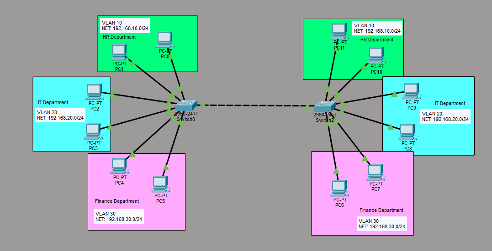
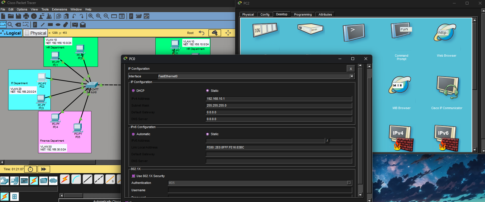
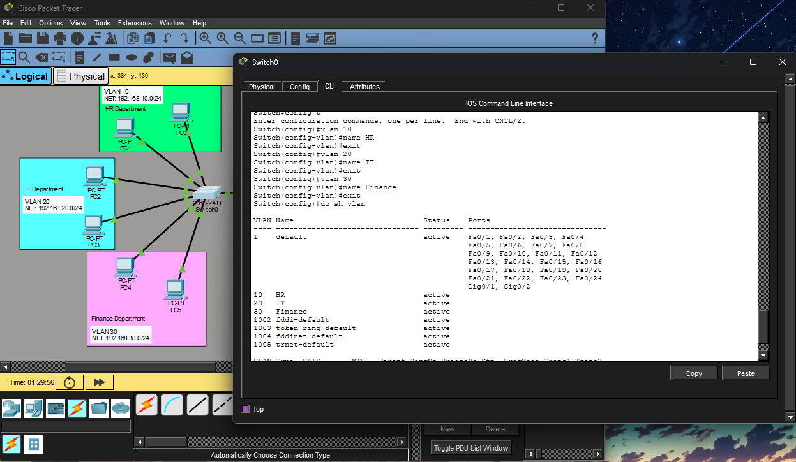
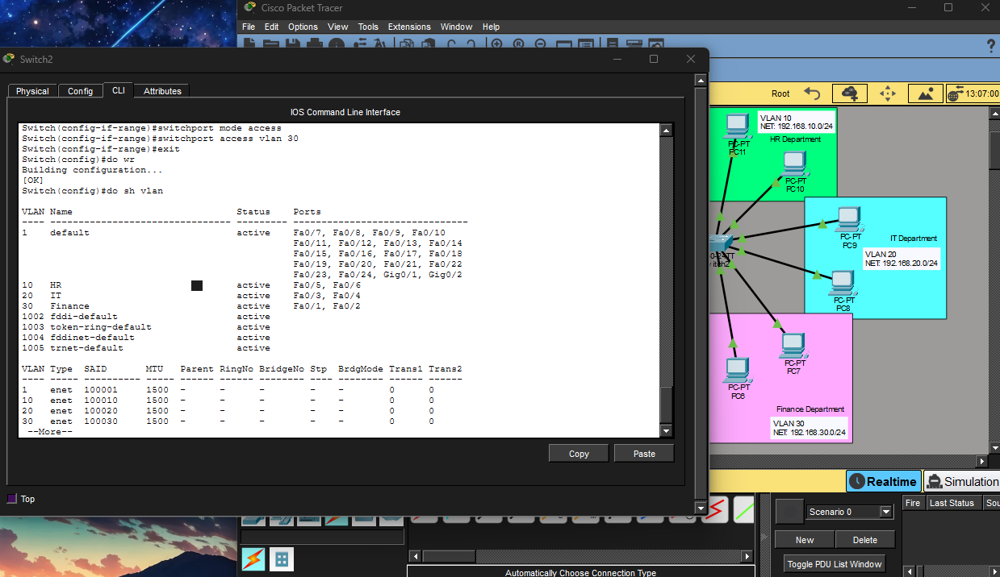
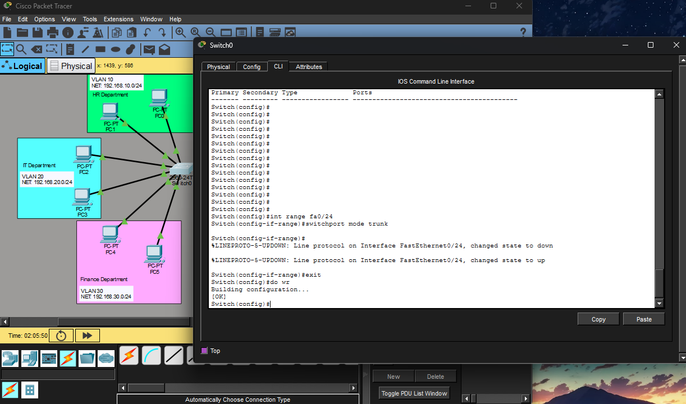

# Cisco Packet Tracer — Level 2: VLANs and Trunking

Building on the basic topology from Level 1, this section covers VLANs (Virtual Local Area Networks) and Trunking — two fundamental concepts in enterprise networking. The goal is to simulate how real companies segment their network by department while sharing the same physical infrastructure.

---

## Environment

| Component | Details |
|---|---|
| Tool | Cisco Packet Tracer |
| Switches | 2x Cisco 2960-24TT |
| End Devices | 12 PCs |
| VLANs | 3 (HR, IT, Finance) |
| Topology | 2 switches connected via trunk link |

---

## What This Covers

- Designing a multi-department network topology
- Assigning static IP addresses per VLAN subnet
- Creating and naming VLANs through the CLI
- Assigning switch ports to their correct VLANs (Access mode)
- Configuring a trunk link between two switches
- Testing VLAN isolation and communication

---

## Network Topology



The topology simulates a small enterprise with two switches serving three departments across two sides of a building. Each department is assigned its own VLAN and subnet to keep traffic completely isolated.

| VLAN | Department | Subnet |
|---|---|---|
| VLAN 10 | HR | 192.168.10.0/24 |
| VLAN 20 | IT | 192.168.20.0/24 |
| VLAN 30 | Finance | 192.168.30.0/24 |

> **Note:** Devices in the same VLAN can communicate with each other. Devices in different VLANs cannot communicate by default — that requires a router, which is covered in Level 3.

---

## Step 1 — Design the Topology

Built the network layout in Packet Tracer using two Cisco 2960-24TT switches connected to each other. Each switch serves three departments with two PCs per department. Color coding and labels were added to make the topology easy to read.

---

## Step 2 — Assign IP Addresses

Each PC was assigned a static IP address matching its VLAN subnet. The third octet of the IP address identifies which VLAN the device belongs to:

- `192.168.10.x` → VLAN 10 (HR)
- `192.168.20.x` → VLAN 20 (IT)
- `192.168.30.x` → VLAN 30 (Finance)



> **Note:** Two devices can share the same last octet as long as they are on different subnets. For example 192.168.10.1 and 192.168.20.1 are completely separate addresses even though both end in .1.

---

## Step 3 — Create VLANs on Each Switch

Clicked on Switch0, opened the CLI tab, and created the three VLANs:

```
en
config t

vlan 10
name HR
exit

vlan 20
name IT
exit

vlan 30
name Finance
exit

do show vlan brief
```

`do show vlan brief` confirms the VLANs were created and named correctly. At this point they have no ports assigned yet — that happens in the next step.



---

## Step 4 — Assign Switch Ports to VLANs

Identified which ports each department's PCs are connected to by hovering over the connection indicators in Packet Tracer, then assigned each group of ports to their correct VLAN using Access mode.

```
en
config t

int range fa0/1-2
switchport mode access
switchport access vlan 10
exit

int range fa0/3-4
switchport mode access
switchport access vlan 20
exit

int range fa0/5-6
switchport mode access
switchport access vlan 30
exit

do wr
```

**Access mode** tells the switch that the connected device is an end device (PC, printer, etc.) and that the port should only carry traffic for one specific VLAN.



> **Important:** This entire process must be repeated on Switch2 — every switch needs its ports assigned to the correct VLANs independently.

---

## Step 5 — Configure the Trunk Link

Set up the trunk link between the two switches on port Fa0/24. A trunk link carries traffic from all VLANs simultaneously — like a multi-lane highway connecting two buildings where each lane represents a different VLAN.

```
int fa0/24
switchport mode trunk
exit
do wr
```



> **Important:** The trunk must be configured on both Switch0 and Switch2. Both ends of the link must be set to trunk mode or the link won't function correctly.

---

## Step 6 — Testing VLAN Communication

**Test 1 — Same VLAN (Should Work)**

Pinged from PC1 (HR, Switch0) to PC10 (HR, Switch2):
```
ping 192.168.10.3
```
Result: ✅ Reply received — HR devices communicate across both switches through the trunk link.

**Test 2 — Different VLAN (Should Fail)**

Pinged from PC1 (HR) to PC2 (IT):
```
ping 192.168.20.1
```
Result: ❌ Request timed out — HR and IT are on different VLANs and cannot communicate without a router.


> **Note:** Getting "Request timed out" when pinging across VLANs is the correct and expected behavior. It confirms that VLAN isolation is working as intended.

---

## Key Takeaways

- VLANs logically separate a network — devices share the same physical switches but their traffic stays completely isolated
- The third octet of the IP address identifies the VLAN subnet — keeps addressing organized and easy to manage
- Access ports connect to end devices and carry traffic for one VLAN only
- Trunk ports connect switches together and carry traffic from all VLANs simultaneously
- Both ends of a trunk link must be configured — one side alone won't work
- Always save with `do wr` after making changes
- VLANs cannot communicate by default — inter-VLAN routing requires a router or Layer 3 switch, covered in Level 3

---

## Related

- [Level 1 — Basic Network Setup & Connectivity](../Level%201/README.md)
- [Packet Tracer Home Lab — Main](../README.md)
